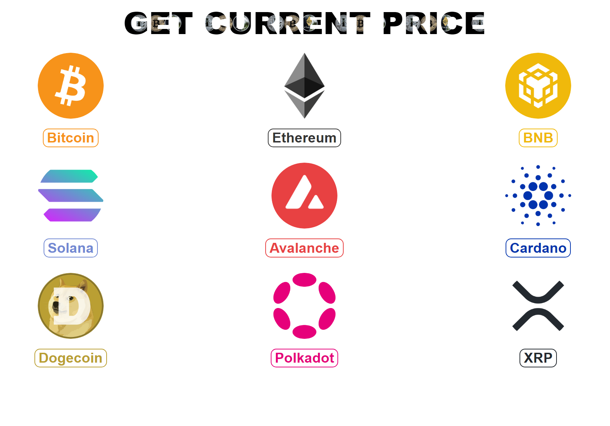

<h1>Get current price</h1>

With this simple, responsive React app you can get the current price of the given cryptocurrencies (Bitcoin, Ethereum, BNB, Solana, Avalanche, Dogecoin, Polkadot, Cardano and XRP)

You can get the price data by clicking the button of the cryptocurrency. The app is using the <a href="https://binance-docs.github.io/apidocs/spot/en/#market-data-endpoints">Binance API</a> for the data fetching with Axios.

<h3>App screenshot</h3>
